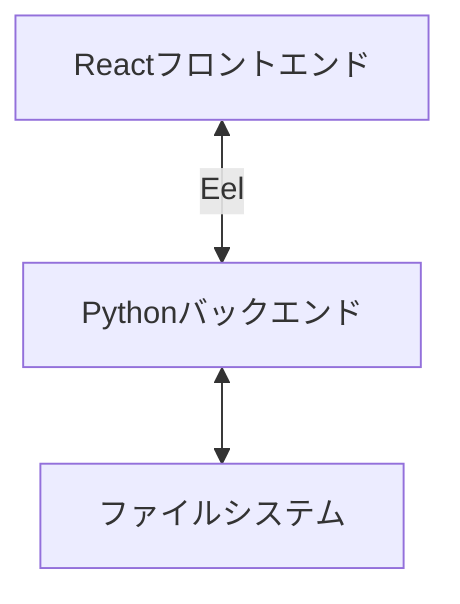
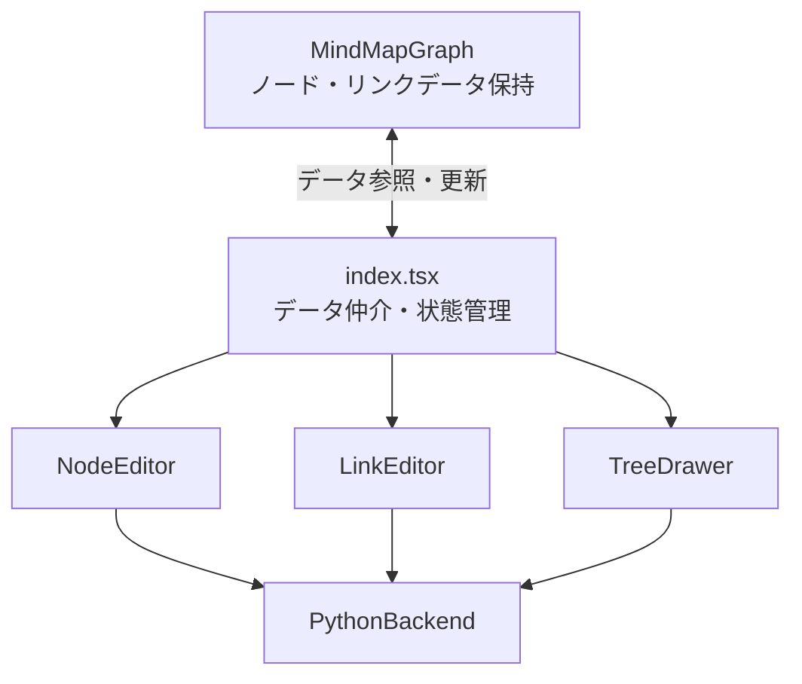
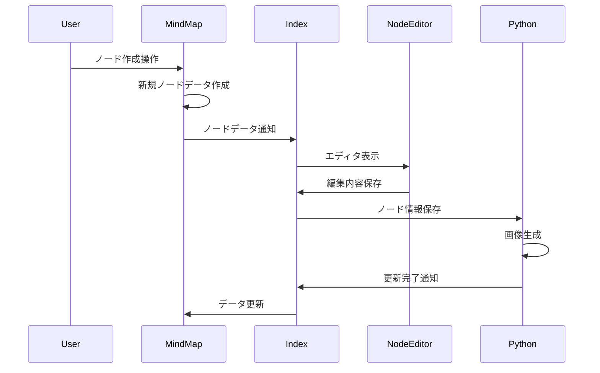
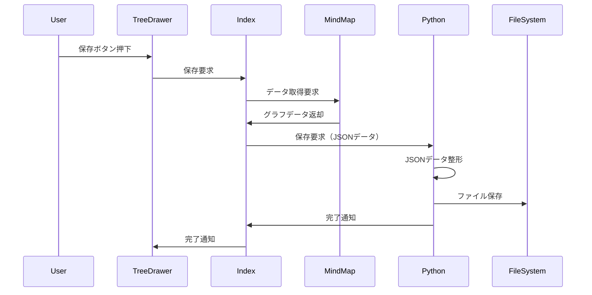

# SpaceMind 詳細設計書

## 1. システム概要

SpaceMindは3Dマインドマップを作成・編集するためのアプリケーションです。PythonとReactを組み合わせたデスクトップアプリケーションとして実装されています。

## 2. システムアーキテクチャ

### 2.1 全体構成



- **フロントエンド**: React + TypeScript
- **バックエンド**: Python + Eel
- **通信方式**: Eelによるブラウザ-Python間通信

### 2.2 主要コンポーネント



#### データフロー
- MindMapGraphコンポーネントがノードとリンクのデータを保持
- index.tsxがMindMapGraphとエディター間のデータ仲介を担当
- 各エディターはindex.tsxを介してデータの参照・更新を実行

## 3. コンポーネント詳細

### 3.1 Pythonバックエンド (main.py)

#### 主要機能
- ファイルシステム操作（JSON読み書き）
- ノード画像生成（HTML+CSSからPNG画像生成）
- Eelによるフロントエンド通信

#### ノード画像生成プロセス
1. ノードの内容とスタイルをHTML+CSSで定義
2. HTMLをPNG画像に変換（Windows: wkhtmltoimage, その他: WeasyPrint）
3. 画像の透明度とラウンド処理
4. 生成した画像をノードの表示用アセットとして保存

#### 重要なメソッド
- `select_file_dialog()`: ファイル選択ダイアログの表示
- `load_json(path)`: JSONファイルの読み込み
- `save_json(data, path)`: JSONファイルの保存
- `generate_images(node_data)`: ノード画像の生成

### 3.2 マインドマップグラフ (MindMapGraph.tsx)

#### 主要機能
- 3Dグラフの描画と操作
- ノード・リンクデータの保持と管理
- インタラクティブな編集機能
- 複数ノード選択機能

#### データ管理
- `graphData`: ノードとリンクのデータを保持する状態
- `selectedNode`: 現在選択中のノードを管理
- `selectedNodeList`: 複数選択されたノードを管理

#### 重要なコンポーネント
- `ForceGraph3D`: 3Dグラフの描画エンジン
- `nodeThreeObjectImageTexture`: ノードの3D表示処理
- `handleClick`: ノードクリック時の処理
- `handleNodeDrag`: ノードドラッグ時の処理

### 3.3 ノードエディタ (NodeEditor.tsx)

#### 主要機能
- ノード内容の編集
- ノードスタイルの設定
- ノードの削除
- 期限の設定

#### UI要素
- テキスト入力エリア
- スタイル選択ドロップダウン
- 期限入力フィールド（datetime-local形式）
- 操作ボタン（OK、キャンセル、削除）

### 3.4 リンクエディタ (LinkEditor.tsx)

#### 主要機能
- リンク名の編集
- リンクの削除
- 接続ノードの確認・選択

#### UI要素
- リンク名入力フィールド
- 接続ノード表示
- 操作ボタン（OK、キャンセル、削除）

### 3.5 ツリードロワー (TreeDrawer.tsx)

#### 主要機能
- ノード検索
- ファイル操作
- 検索結果の表示

#### UI要素
- 検索入力フィールド
- 検索結果リスト
- ファイル操作ボタン
- 保存ボタン

## 4. データ構造

### 4.1 ノードデータ
```typescript
interface NodeData {
    id: number;
    name: string;
    img: string;
    group?: number;
    style_id: number;
    x?: number;
    y?: number;
    z?: number;
    fx?: number;
    fy?: number;
    fz?: number;
    size_x: number;
    size_y: number;
    deadline?: string;  // 期限（YYYY-MM-DDTHH:mm形式）
}
```

### 4.2 リンクデータ
```typescript
interface LinkData {
    index: number;
    source: NodeData;
    target: NodeData;
    name: string;
}
```

## 5. 主要な処理フロー

### 5.1 ノード作成フロー


### 5.2 ファイル保存フロー


## 6. 技術スタック

### 6.1 フロントエンド
- React
- TypeScript
- Three.js (3D描画)
- Ant Design (UIコンポーネント)

### 6.2 バックエンド
- Python
- Eel (ブラウザ通信)
- PIL (画像処理)

## 7. 拡張性と制約

### 7.1 拡張性
- ノードスタイルの追加が容易
- 新しい操作モードの追加が可能
- データ構造の拡張が可能

### 7.2 制約
- ブラウザ依存の制限
- ローカルファイルシステムへのアクセスはPython側で実施
- 画像生成処理はOSによって異なる実装が必要

### 7.3 ノード表示仕様
- ノード名は中央に表示
- 期限が設定されている場合、ノード名の下部に赤字で表示
- スタイルに応じた枠線とカラーリングを適用
