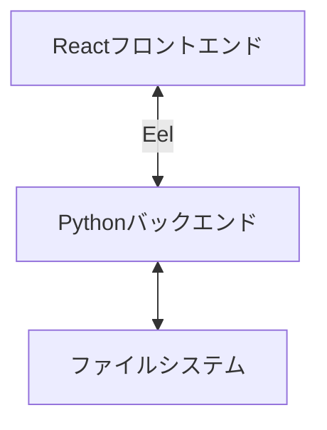
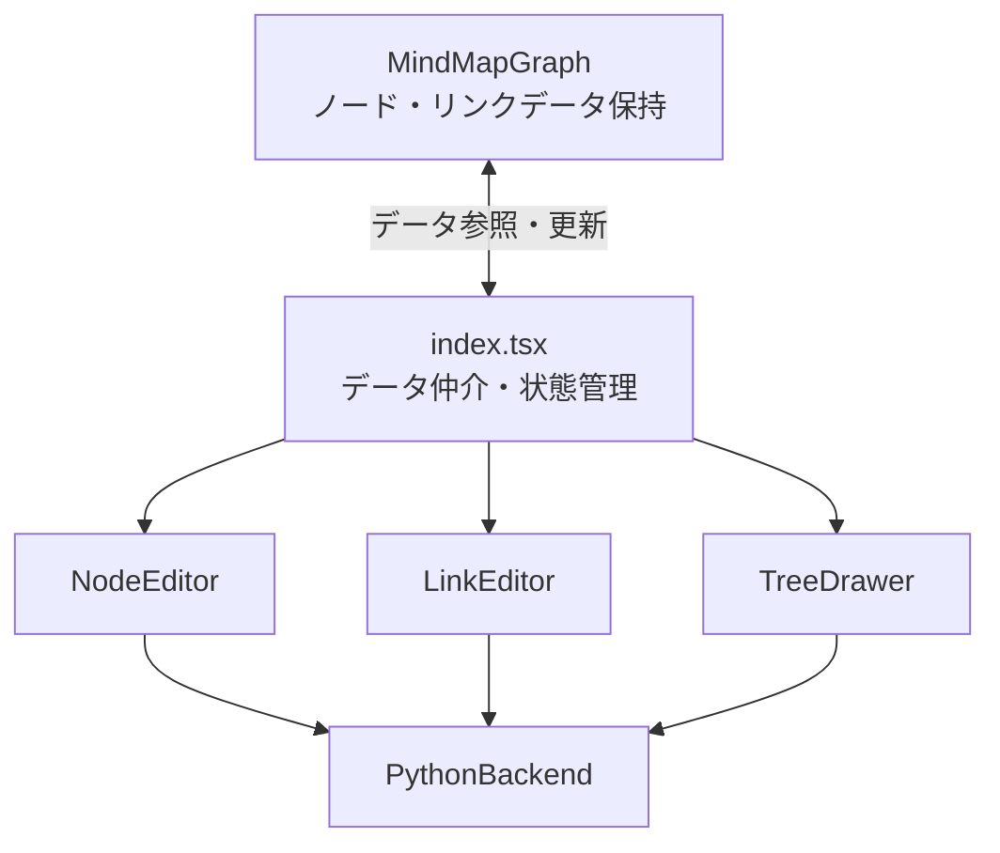
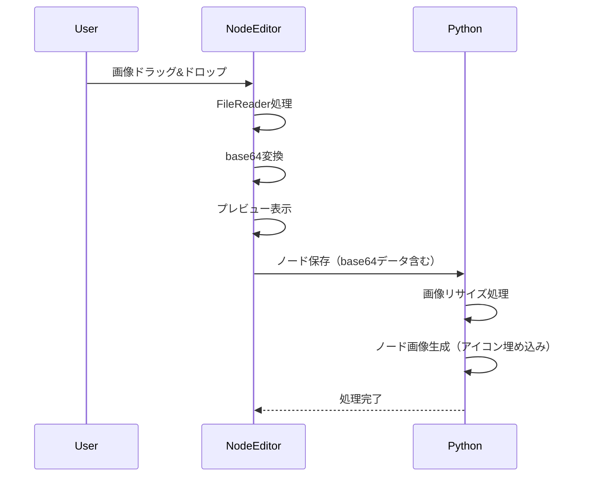
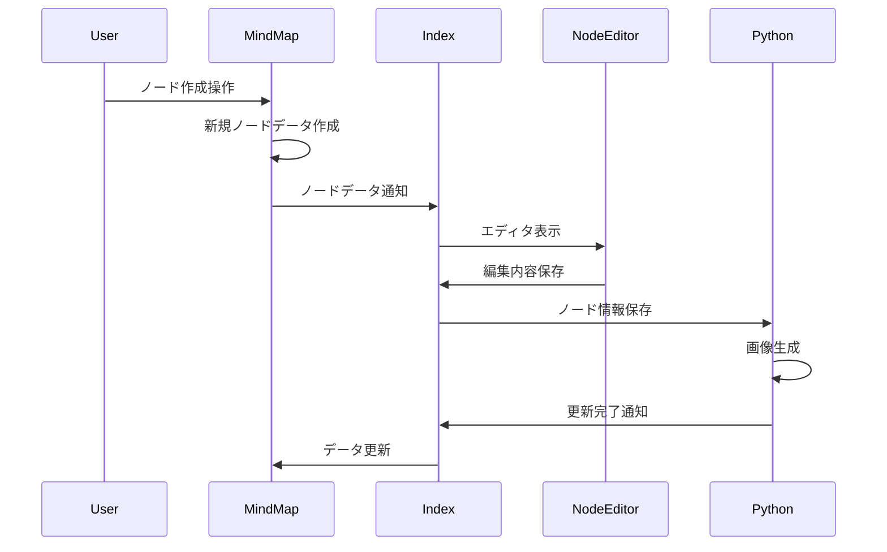
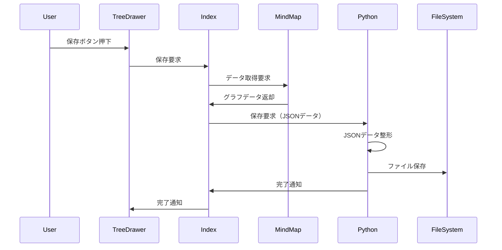
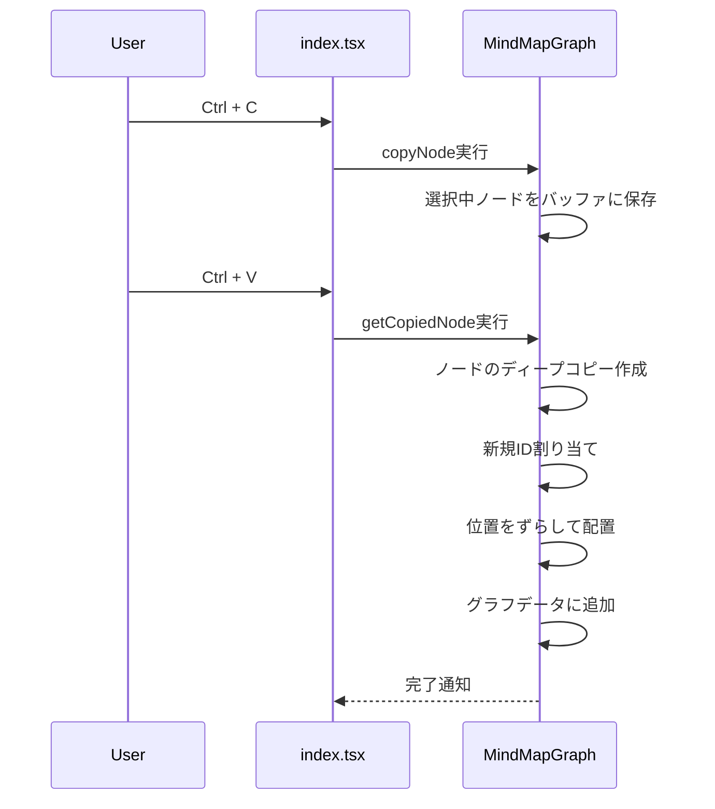
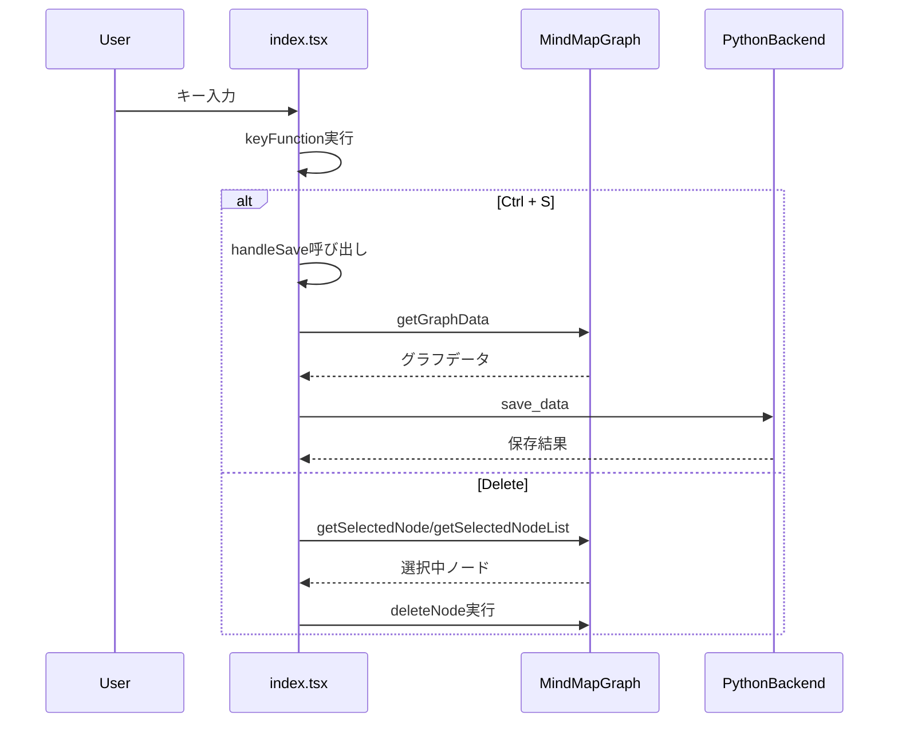
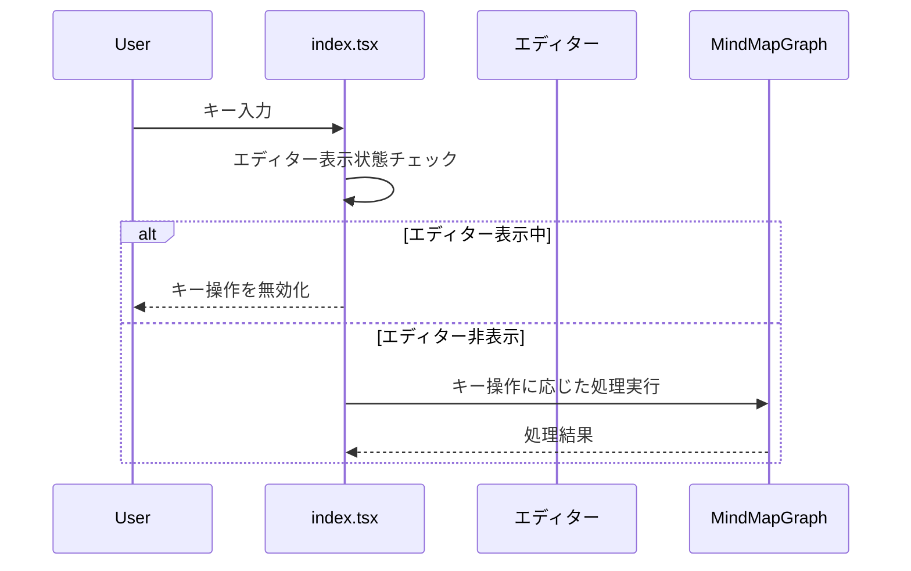

# SpaceMind 詳細設計書

## 1. システム概要

SpaceMindは3Dマインドマップを作成・編集するためのアプリケーションです。PythonとReactを組み合わせたデスクトップアプリケーションとして実装されています。

## 2. システムアーキテクチャ

### 2.1 全体構成



- **フロントエンド**: React + TypeScript
- **バックエンド**: Python + Eel
- **通信方式**: Eelによるブラウザ-Python間通信

### 2.2 主要コンポーネント



#### データフロー
- MindMapGraphコンポーネントがノードとリンクのデータを保持
- index.tsxがMindMapGraphとエディター間のデータ仲介を担当
- 各エディターはindex.tsxを介してデータの参照・更新を実行

## 3. コンポーネント詳細

### 3.1 Pythonバックエンド (main.py)

#### 主要機能
- ファイルシステム操作（JSON読み書き）
- ノード画像生成（HTML+CSSからPNG画像生成）
- Eelによるフロントエンド通信

#### ノード画像生成プロセス
1. ノードの内容とスタイルをHTML+CSSで定義
2. アイコン画像がある場合、base64形式で直接HTMLに埋め込み
3. HTMLをPNG画像に変換（Windows: wkhtmltoimage, その他: WeasyPrint）
4. 画像の透明度とラウンド処理
5. 生成した画像をノードの表示用アセットとして保存

#### 重要なメソッド
- `select_file_dialog()`: ファイル選択ダイアログの表示
- `load_json(path)`: JSONファイルの読み込み
- `save_json(data, path)`: JSONファイルの保存
- `generate_images(node_data)`: ノード画像の生成
- `process_base64_image(base64_str, max_size)`: アイコン画像のリサイズ処理

### 3.2 マインドマップグラフ (MindMapGraph.tsx)

#### 主要機能
- 3Dグラフの描画と操作
- ノード・リンクデータの保持と管理
- インタラクティブな編集機能
- 複数ノード選択機能
- ノードのコピー&ペースト機能
- 3Dオブジェクトの表示と操作
- 背景の星のアニメーション表示
- Undo/Redoのための履歴管理
- 多様なノードタイプのサポート（通常、課題、タスク、リンク、ファイル、フォルダー、3Dオブジェクト）

#### データ管理
- `graphData`: ノードとリンクのデータを保持する状態
- `selectedNode`: 現在選択中のノードを管理
- `selectedNodeList`: 複数選択されたノードを管理
- `copiedNodeRef`: コピーされたノードの参照を保持（useRefで管理）
- `historyRef`: 操作履歴を管理するための参照
- `historyIndexRef`: 現在の履歴位置を管理

#### 重要なメソッド
- `copyNode`: 選択中のノードをコピーしてバッファに保存
- `getCopiedNode`: コピーされたノードのディープコピーを取得
- `addNode`: 新規ノードを追加（ペースト操作で使用）
  - コピー元の位置から少しずらして配置
  - 新規IDを割り当て
  - スタイル、アイコン、期限などの属性を保持

#### 重要なコンポーネント
- `ForceGraph3D`: 3Dグラフの描画エンジン
- `nodeThreeObjectImageTexture`: ノードの3D表示処理（画像とメッシュの切り替え）
- `MovingStars`: 背景の星アニメーション
- `handleClick`: ノードクリック時の処理
- `handleNodeDrag`: ノードドラッグ時の処理
- `handleDoubleClick`: ダブルクリック時の特殊処理（URL、ファイル、フォルダの開き）

### 3.3 ノードエディタ (NodeEditor.tsx)

#### 主要機能
- ノード内容の編集
- ノードタイプの選択（通常、課題、タスク、リンク、ファイル、フォルダー、3Dオブジェクト）
- ノードスタイルの設定
- アイコン画像の設定（ドラッグ&ドロップ対応、サイズ調整可能）
- ノードの削除と無効化
- タスクノードの属性設定（期限、重要度、緊急度）
- 3Dオブジェクトのモデル選択とスケール調整
- 課題ノードの背景色設定

#### UI要素
- ノードタイプ選択ドロップダウン
- テキスト入力エリア（複数行対応）
- スタイル選択ドロップダウン
- アイコン画像アップロードエリア（プレビュー表示、サイズ調整スライダー付き）
- タスク用フィールド（期限、重要度、緊急度）
- リンク用URLフィールド
- ファイル・フォルダー用パス選択UI
- 3Dオブジェクト用モデル選択とスケール調整
- 課題用背景色ピッカー
- 操作ボタン（OK、キャンセル、削除、無効化/有効化）

#### アイコン画像処理フロー


### 3.4 リンクエディタ (LinkEditor.tsx)

#### 主要機能
- リンク名の編集
- リンクの削除
- 接続ノードの表示と相互参照
- ソース・ターゲットノードへのクイックジャンプ

#### UI要素
- リンク名入力フィールド
- 接続ノード表示（クリック可能なリンク形式）
- エッジのソースとターゲットの視覚的表示（矢印付き）
- 操作ボタン（OK、キャンセル、削除）

### 3.5 ツリードロワー (TreeDrawer.tsx)

#### 主要機能
- ノード検索
- ファイル操作
- 検索結果の表示

#### UI要素
- 検索入力フィールド
- 検索結果リスト
- ファイル操作ボタン
- 保存ボタン

## 4. データ構造

### 4.1 ノードデータ
```typescript
interface NodeData {
    id: number;
    name: string;
    img: string;
    group?: number;
    style_id: number;
    x?: number;
    y?: number;
    z?: number;
    fx?: number;
    fy?: number;
    fz?: number;
    size_x: number;
    size_y: number;
    deadline?: string;  // 期限（YYYY-MM-DDTHH:mm形式）
    priority?: number | null;  // 重要度（未選択、または1:最低～5:最高）
    urgency?: number | null;  // 緊急度（未選択、または1:最低～5:最高）
    icon_img?: string;  // アイコン画像（base64形式）
    icon_size?: number; // アイコン画像のサイズ（px）
    createdAt: string;  // 作成日時（ISO 8601形式）
    updatedAt: string;  // 更新日時（ISO 8601形式）
    disabled?: boolean; // ノードの無効化フラグ
    type?: string;     // ノードタイプ（"normal" | "issue" | "task" | "link" | "file" | "folder" | "3dobject"）
    url?: string;      // リンクタイプのURL
    file_path?: string; // ファイルタイプのパス
    folder_path?: string; // フォルダータイプのパス
    scale?: number;    // 3Dオブジェクトのスケール（0.1 to 2.0）
    background?: string; // 課題タイプの背景色
}
```

### 4.2 リンクデータ
```typescript
interface LinkData {
    index: number;
    source: NodeData;
    target: NodeData;
    name: string;
}
```

## 5. 主要な処理フロー

### 5.1 ノード作成フロー


### 5.2 ファイル保存フロー


### 5.3 ノードコピー&ペーストフロー


## 6. 技術スタック

### 6.1 フロントエンド
- React
- TypeScript
- Three.js (3D描画)
- Ant Design (UIコンポーネント)

### 6.2 バックエンド
- Python
- Eel (ブラウザ通信)
- PIL (画像処理)

## 7. 拡張性と制約

### 7.1 拡張性
- ノードスタイルの追加が容易
- 新しい操作モードの追加が可能
- データ構造の拡張が可能
- 3Dモデルの追加が容易
- ノードタイプの追加が容易
- Undo/Redoシステムの拡張が可能

### 7.2 制約
- ブラウザ依存の制限
- ローカルファイルシステムへのアクセスはPython側で実施
- 画像生成処理はOSによって異なる実装が必要
- 3Dモデルのサイズ制限
- リアルタイム更新時のパフォーマンス制約

### 7.3 ノード表示仕様
- アイコン画像がある場合、ノード名の上部に表示（最大幅500px、アスペクト比保持）
- ノード名は中央に表示（改行・空白を保持）
- 期限が設定されている場合、ノード名の下部に赤字で表示
- 重要度が設定されている場合（未選択以外）、期限の下に青字で★マークを表示（1～5個）
- 緊急度が設定されている場合（未選択以外）、重要度の下に緑字で★マークを表示（1～5個）
- スタイルに応じた枠線とカラーリングを適用

## 8. キー操作イベントハンドラ

### 8.1 イベントハンドラの設計



### 8.2 キー操作一覧

#### グローバルキー操作
- **Ctrl + S**: 現在のマインドマップを保存
  - index.tsxでキャッチし、handleSave関数を実行
  - MindMapGraphからデータを取得しPythonバックエンドで保存
  - 保存結果をメッセージで表示
- **Ctrl + C**: 選択中のノードをコピー
  - MindMapGraphのcopyNode関数を実行
  - 選択中のノードの情報を内部バッファに保存
- **Ctrl + V**: コピーしたノードをペースト
  - MindMapGraphのgetCopiedNode関数でコピーされたノードを取得
  - 新規ノードとして追加（位置はコピー元からずらして配置）
  - コピー時の属性（スタイル、アイコン、期限など）を保持
- **Ctrl + A**: 全てのノードを選択
  - index.tsxでキャッチし、MindMapGraphのgetGraphData関数でノードリストを取得
  - 現在の選択をクリア（clearSelectedNode関数を実行）
  - 全ノードを選択状態に設定（setSelectedNodeList関数を実行）
  - 選択されたノードは青色（0x4169e1）でハイライト表示
  - 選択された全ノードは一括でドラッグ移動可能

### 8.2.1 複数ノードの同時ドラッグ処理

#### 機能概要
複数のノードを選択し、それらを一括で移動できる機能です。選択されたノードは視覚的にハイライト表示され、1つのノードをドラッグすると選択された全てのノードが同じ移動量で移動します。

#### 選択の仕組み
1. 通常選択
   - 単一のノードをクリックすると、そのノードのみが選択状態になります
   - 選択中のノードは白色でハイライト表示されます
   - 他のノードをクリックすると、前の選択は解除されます

2. 複数選択
   - Ctrlキーを押しながらノードをクリックすることで、複数のノードを選択できます
   - 既に選択されているノードをCtrlキーを押しながらクリックすると、そのノードの選択が解除されます
   - 複数選択されたノードは青色（0x4169e1）でハイライト表示されます
   - 通常クリック（Ctrlキーなし）で別のノードを選択すると、複数選択は解除されます

#### ドラッグ処理の仕組み
1. ドラッグ開始時
   - 選択されたノードの中の1つをドラッグすると、複数ドラッグ処理が開始されます
   - ドラッグ開始時の各ノードの位置が記録されます

2. ドラッグ中
   - ドラッグ中のノードの移動量（X軸、Y軸、Z軸それぞれの移動距離）が計算されます
   - 他の選択中のノードも、計算された移動量と同じだけ移動します
   - これにより、選択された全てのノードが相対的な位置関係を保ったまま移動します

3. ドラッグ終了時
   - 各ノードの最終位置が確定され、その位置に固定されます
   - ドラッグ中に使用された一時的な位置情報（移動量計算用）がクリアされます
   - ドラッグしたノードが複数選択の一部である場合、選択状態は維持されます
   - ドラッグしたノードが複数選択の一部でない場合、通常の単一選択状態に戻ります

#### 視覚的フィードバック
- 複数選択中のノードは青色でハイライト表示されます
- 単一選択中のノードは白色でハイライト表示されます
- 非選択のノードは通常の表示（グレー）となります
- ドラッグ中も選択状態に応じたハイライト表示が維持されます

#### ノード操作
- **Delete**: 選択中のノードを削除
  - index.tsxでキャッチし、選択中のノードを取得
  - 単一選択の場合はgetSelectedNodeで取得
  - 複数選択の場合はgetSelectedNodeListで取得
  - 取得したノードをMindMapGraphのdeleteNode関数で削除

### 8.3 エディター表示中のキー操作制御

#### 設計方針
- エディター（モーダル・ドロワー）表示中はグローバルキー操作を無効化
- 各エディターの状態をindex.tsxで管理
- キー操作前にエディターの表示状態をチェック



#### 実装ポイント
1. エディター状態管理
```typescript
// index.tsxでの状態管理
const [isNodeEditorOpen, setIsNodeEditorOpen] = useState(false);
const [isLinkEditorOpen, setIsLinkEditorOpen] = useState(false);
const [isTreeDrawerOpen, setIsTreeDrawerOpen] = useState(false);
```

2. エディターコンポーネントの実装
```typescript
interface EditorProps {
    onClose: () => void;  // エディターを閉じる際の状態更新用
    // その他のProps
}
```

3. キー操作制御
```typescript
const keyFunction = useCallback((event: any) => {
    // エディター表示中はキー操作を無効化
    if (isNodeEditorOpen || isLinkEditorOpen || isTreeDrawerOpen) return;
    
    // 以降、通常のキー操作処理
}, [isNodeEditorOpen, isLinkEditorOpen, isTreeDrawerOpen]);
```

### 8.4 実装方針
- キー操作のイベントハンドラはindex.tsxで一元管理
- useEffectでコンポーネントマウント時にイベントリスナーを登録
- キー操作に応じて適切なコンポーネントのメソッドを呼び出し
- 各機能の実装は対応するコンポーネントに委譲

## 9. 設計注意事項

### 9.1 モーダル・ドロワー実装時の注意点

1. 状態管理
- モーダルやドロワーの表示状態は必ずindex.tsxで管理する
- 各コンポーネントの内部状態（isOpen等）は使用しない
- 表示状態の変更は必ずonCloseプロパティ経由で行う

2. キー操作の制御
- モーダルやドロワーを実装する際は、必ずindex.tsxの状態管理に組み込む
- グローバルキー操作との競合を防ぐため、表示状態をkeyFunctionで考慮する
- テキスト入力フィールドでのキー操作（Enter等）は、エディター表示中でも有効とする

3. コンポーネント設計
```typescript
// 推奨実装パターン
interface EditorComponentProps {
    onClose: () => void;  // 必須
    // その他の必要なProps
}

const EditorComponent = ({ onClose, ...props }) => {
    // 内部でのモーダル状態管理は行わない
    // すべての閉じる操作でonCloseを呼び出す
};
```

4. 実装チェックリスト
- [ ] index.tsxで表示状態を管理するstateを追加
- [ ] コンポーネントにonCloseプロパティを追加
- [ ] すべての閉じる操作（OK、キャンセル、×ボタン等）でonCloseを呼び出す
- [ ] keyFunctionで表示状態をチェックする条件に追加
