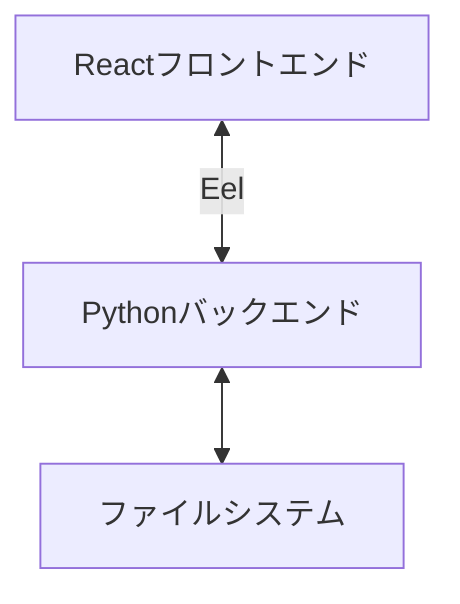
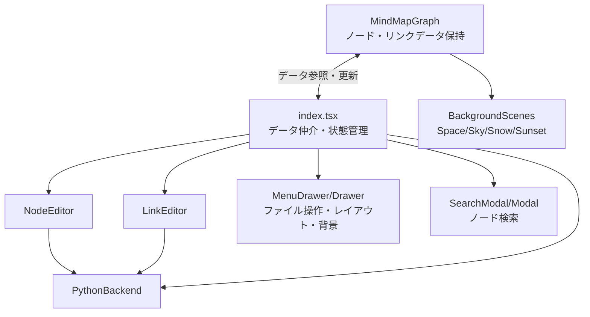
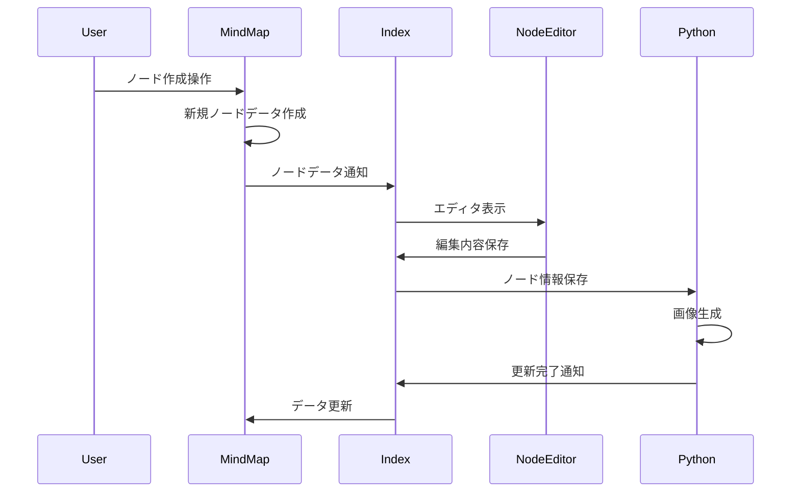
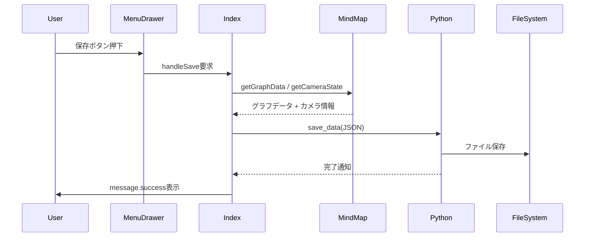
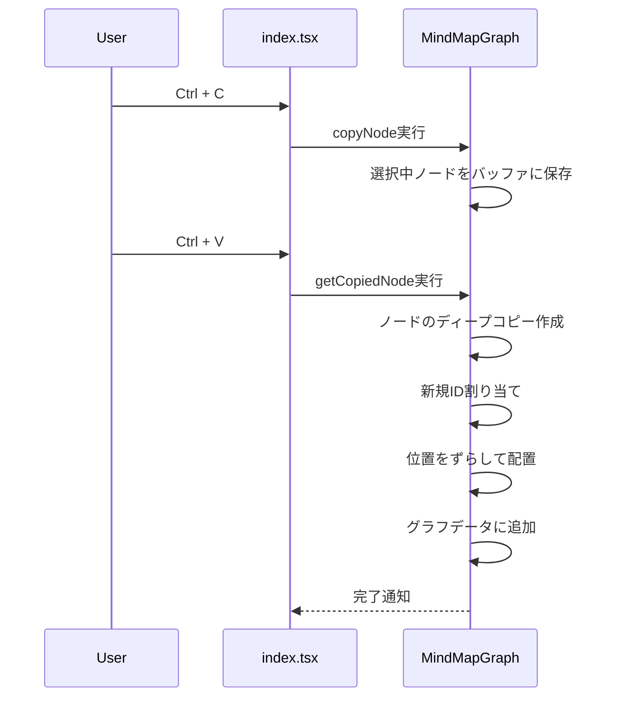
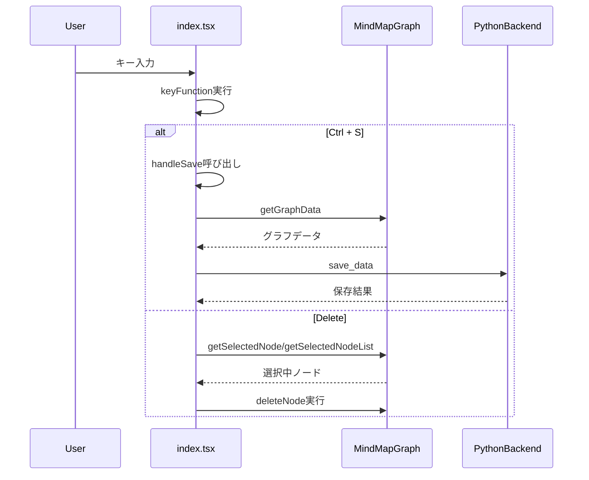
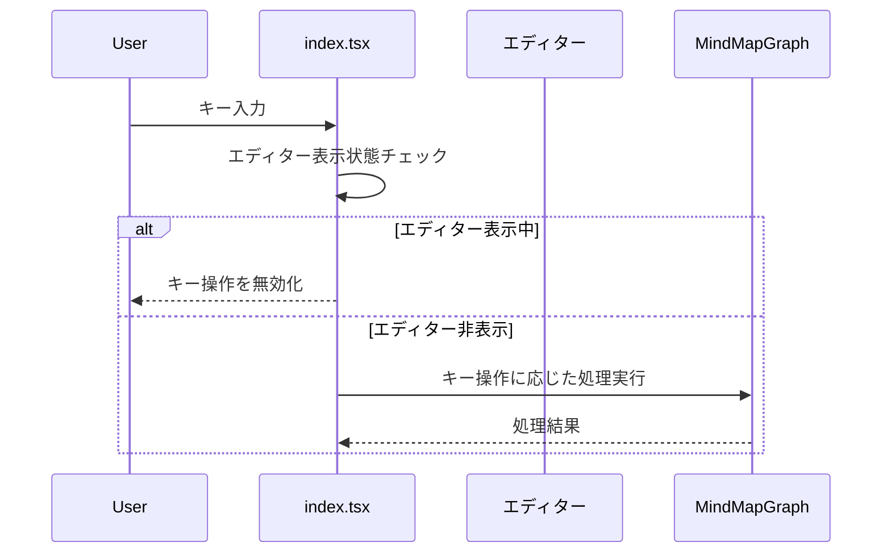

# SpaceMind 詳細設計書

## 1. システム概要

SpaceMindは3Dマインドマップを作成・編集するためのアプリケーションです。PythonとReactを組み合わせたデスクトップアプリケーションとして実装されています。

## 2. システムアーキテクチャ

### 2.1 全体構成


```mermaid
graph TB
    Frontend[Reactフロントエンド]
    Backend[Pythonバックエンド]
    FileSystem[ファイルシステム]
    
    Frontend <--> |Eel| Backend
    Backend <--> FileSystem
```

- **フロントエンド**: React + TypeScript
- **バックエンド**: Python + Eel
- **通信方式**: Eelによるブラウザ-Python間通信

### 2.2 主要コンポーネント


```mermaid
graph TB
    MindMap[MindMapGraph<br>ノード・リンクデータ保持]
    Index[index.tsx<br>データ仲介・状態管理]
    NodeEdit[NodeEditor]
    LinkEdit[LinkEditor]
    MenuDrawer[MenuDrawer/Drawer<br>ファイル操作・レイアウト・背景]
    SearchModal[SearchModal/Modal<br>ノード検索]
    Python[PythonBackend]
    Background[BackgroundScenes<br>Space/Sky/Snow/Sunset]
    
    MindMap <--> |データ参照・更新| Index
    Index --> NodeEdit
    Index --> LinkEdit
    Index --> MenuDrawer
    Index --> SearchModal
    MindMap --> Background
    NodeEdit --> Python
    LinkEdit --> Python
    Index --> Python
```

#### データフロー
- MindMapGraphコンポーネントがノードとリンクのデータを保持
- index.tsxがMindMapGraphと各エディター/モーダル間のデータ仲介を担当
- 各エディターはindex.tsxを介してデータの参照・更新を実行
- 背景シーンはMindMapGraphの `globalBackground` 状態に応じて切り替わる

## 3. コンポーネント詳細

### 3.1 Pythonバックエンド (main.py)

#### 主要機能
- ファイルシステム操作（JSON読み書き、保存ダイアログ）
- ノード画像生成（Jinja2テンプレートとwkhtmltoimageによるPNG生成）
- アイコン画像のリサイズ・加工処理（PIL）
- システム連携（既定のアプリでファイル/フォルダを開く）
- 最近使用したファイルの管理
- Eelによるフロントエンド通信

#### ノード画像生成プロセス
1. ノードの内容とスタイルをHTML+CSS（Jinja2）で定義
2. アイコン画像がある場合、`process_base64_image` でリサイズし、base64形式でHTMLに埋め込み
3. `imgkit` (wkhtmltoimageのラッパー) を使用してHTMLをPNG画像に変換
   - Windows: 同梱の `wkhtmltoimage.exe` を使用
   - Linux: システムの `/usr/bin/wkhtmltoimage` または PATH上のコマンドを使用
4. 生成された画像を `PIL` で読み込み、色反転・クロップ・透過処理・角丸処理を実行
5. 生成した画像を `node_img/` ディレクトリに一意の名前（ID+タイムスタンプ）で保存

#### 主要なメソッド（Eel公開）
- `init()`: アプリケーションの初期化
- `select_file_dialog()`: JSONファイル選択ダイアログを表示
- `load_json_by_path(path)`: 指定されたパスからデータを読み込み
- `get_recent_files()`: 最近使用したファイルのリストを取得
- `save_data(data)`: 現在のファイルにデータを保存
- `save_as_data(data)`: 名前を付けて保存ダイアログを表示
- `generate_image(node)`: 単一ノードの画像を生成し、保存パスとサイズを返却
- `open_file(file_path)`: システムの既定アプリでファイルを開く
- `open_folder(folder_path)`: システムのファイルエクスプローラーでフォルダを開く
- `select_any_file()` / `select_folder()`: 汎用的なファイル/フォルダ選択ダイアログを表示

### 3.2 マインドマップグラフ (MindMapGraph.tsx)

#### 主要機能
- 3Dグラフの描画と操作（react-force-graph-3d）
- ノード・リンクデータの管理（追加、削除、更新、検索）
- 複数ノードの選択と一括ドラッグ移動
- ノードのコピー/切り取り/貼り付け機能（Ctrl+C, Ctrl+X, Ctrl+V）
- 3Dオブジェクトノードのサポート（Horse, Watch, Cat, Bird, Bird2, Airplane）
- リンク作成機能（'L'キーによる一括リンク作成、マウスドラッグによるリンク張り）
- 4種類の背景シーン切替（Space, Sky, Snow, Sunset）
- 自動レイアウト機能（Tree Layout 4方向, Circle Layout, Free Layout）
- カメラ状態（位置・注視点）の保存と復元
- Undo/Redoによる操作履歴管理（useHistory hook）
- マウス速度に応じた可変パン/回転速度制御
- ホバー時のケバブメニュー（⋮）によるクイックアクセス
- 右クリックによるコンテキストメニュー

#### データ管理
- `graphData`: ノード、リンク、`globalBackground` を保持
- `selectedNode`: 単一選択中のノード
- `selectedNodeList`: 複数選択中のノードリスト
- `copiedNodeRef`: コピーされたノードデータのバッファ
- `undo/redo`: 操作履歴をスタックで管理

#### 重要なメソッド（外部公開）
- `getGraphData()` / `setGraphData(data)`: グラフデータの取得と設定
- `addNewNode()`: 現在の選択位置付近に新規ノードを追加
- `addLink(source, target)`: ノード間にリンクを作成
- `arrangeNodes(layout)`: 指定したアルゴリズムで自動レイアウトを実行
- `searchNodes(text)`: ノード名による部分一致検索
- `focusOnNode(node)`: 指定したノードにカメラをズーム・移動
- `undo()` / `redo()`: 操作履歴を戻す/進める
- `setGlobalBackground(bg)`: 背景シーンを切り替える

#### 内部処理
- `nodeThreeObjectImageTexture`: ノードの表示オブジェクト（Spriteまたは3Dモデル）を生成
- `handleNodeDrag`: 複数選択時は全ノードを相対的に移動
- `variable speed control`: マウスの移動速度を計算し、Three.jsのOrbitControlsの感度を動的に調整

### 3.3 ノードエディタ (NodeEditor.tsx)

#### 主要機能
- ノード情報の編集（名称、タイプ、スタイル/モデル、アイコン画像）
- ノードタイプの切り替え（通常、課題、タスク、リンク、ファイル、フォルダ、3Dオブジェクト）
- アイコン画像のアップロードとサイズ調整（ドラッグ&ドロップ対応）
- タイプ別の特定フィールドの編集
  - タスク: 期限、重要度、緊急度
  - リンク: URL
  - ファイル/フォルダ: システムダイアログによるパス選択
  - 3Dオブジェクト: モデル選択とスケール調整
- ノードの有効化/無効化（半透明表示）

#### UI要素
- タイプ選択ドロップダウン
- コンテンツ入力（TextArea, Shift+Enterで保存）
- スタイル/フレーム選択（通常・課題タイプのみ）
- アイコンアップロードエリアとサイズ調整スライダー
- 3Dオブジェクト用モデル選択とスケールスライダー
- タスク用属性（日付入力、重要度/緊急度Select）
- ファイル/フォルダパス入力と選択ボタン

### 3.4 リンクエディタ (LinkEditor.tsx)

#### 主要機能
- リンク名の編集
- 接続されているソースノードとターゲットノードの名称表示
- ノード名クリックによる該当ノードへのジャンプ（選択・フォーカス）
- リンクの削除

### 3.5 メニュードロワーと検索モーダル (index.tsx)

#### メニュードロワー (Drawer + Menu)
画面左上のボタンで開閉する管理メニュー。
- **File**: ファイルを開く、最近使ったファイル、保存、名前を付けて保存、新規ウィンドウ
- **Edit**: 元に戻す、やり直し、切り取り、コピー、貼り付け、検索
- **Layout**: Tree Layout (4方向), Circle Layout, Free Layout
- **Background**: Space, Sky, Snowy Morning, Sunset シーンの切り替え

#### ノード検索モーダル (Modal + List)
Ctrl+F で呼び出す検索インターフェース。
- ノード名のリアルタイムフィルタリング
- 検索結果リストからノードを選択すると、そのノードにカメラがフォーカスし、選択状態になる


## 4. データ構造

### 4.1 ノードデータ
```typescript
interface NodeData {
    id: number;
    name: string;
    img: string;        // 生成された画像パス
    type?: string;      // "normal" | "issue" | "task" | "link" | "file" | "folder" | "3dobject"
    group?: number;
    style_id: number;   // スタイルIDまたは3DモデルID (1-6)
    
    // 座標・位置管理
    fx?: number; fy?: number; fz?: number; // 固定座標
    x?: number; y?: number; z?: number;    // 現在の座標
    _originalX?: number; _originalY?: number; _originalZ?: number; // 複数ドラッグ開始時の基準位置
    
    // サイズ・回転
    size_x?: number; size_y?: number; // 表示サイズ
    rot_x?: number; rot_y?: number;   // 3Dオブジェクトの回転
    scale?: number;                   // 3Dオブジェクトのスケール
    
    // タイプ別属性
    deadline?: string;
    priority?: number | null;
    urgency?: number | null;
    url?: string;
    file_path?: string;
    folder_path?: string;
    
    // アイコン
    icon_img?: string;  // base64データ
    icon_size?: number; // アイコン表示サイズ(px)
    
    // メタデータ
    createdAt: string;
    updatedAt: string;
    disabled?: boolean;
    isNew?: boolean;    // 新規作成フラグ
}
```

### 4.2 リンクデータ
```typescript
interface LinkData {
    index: number;
    source: NodeData | number;
    target: NodeData | number;
    name: string;
    isNew?: boolean;
}
```

### 4.3 グラフデータ (GraphData)
```typescript
interface GraphData {
    nodes: NodeData[];
    links: LinkData[];
    globalBackground?: string; // 'space' | 'sky' | 'snow' | 'sunset'
    camera?: {                 // カメラの保存状態
        position: { x: number, y: number, z: number };
        lookAt: { x: number, y: number, z: number };
    };
}
```

## 5. 主要な処理フロー

### 5.1 ノード作成フロー

```mermaid
sequenceDiagram
    participant User
    participant MindMap
    participant Index
    participant NodeEditor
    participant Python
    
    User->>MindMap: ノード作成操作
    MindMap->>MindMap: 新規ノードデータ作成
    MindMap->>Index: ノードデータ通知
    Index->>NodeEditor: エディタ表示
    NodeEditor->>Index: 編集内容保存
    Index->>Python: ノード情報保存
    Python->>Python: 画像生成
    Python->>Index: 更新完了通知
    Index->>MindMap: データ更新
```

### 5.2 ファイル保存フロー

```mermaid
sequenceDiagram
    participant User
    participant Menu as MenuDrawer
    participant Index
    participant MindMap
    participant Python
    participant FileSystem
    
    User->>Menu: 保存ボタン押下
    Menu->>Index: handleSave要求
    Index->>MindMap: getGraphData / getCameraState
    MindMap-->>Index: グラフデータ + カメラ情報
    Index->>Python: save_data(JSON)
    Python->>FileSystem: ファイル保存
    Python-->>Index: 完了通知
    Index->>User: message.success表示
```

### 5.3 ノードコピー&ペーストフロー

```mermaid
sequenceDiagram
    participant User
    participant Index as index.tsx
    participant MindMap as MindMapGraph
    
    User->>Index: Ctrl + C
    Index->>MindMap: copyNode実行
    MindMap->>MindMap: 選択中ノードをバッファに保存
    
    User->>Index: Ctrl + V
    Index->>MindMap: getCopiedNode実行
    MindMap->>MindMap: ノードのディープコピー作成
    MindMap->>MindMap: 新規ID割り当て
    MindMap->>MindMap: 位置をずらして配置
    MindMap->>MindMap: グラフデータに追加
    MindMap-->>Index: 完了通知
```

## 6. 技術スタック

### 6.1 フロントエンド
- React
- TypeScript
- Three.js (3D描画)
- Ant Design (UIコンポーネント)

### 6.2 バックエンド
- Python
- Eel (ブラウザ通信)
- PIL (画像処理)

## 7. 拡張性と制約

### 7.1 拡張性
- ノードスタイルの追加が容易
- 新しい操作モードの追加が可能
- データ構造の拡張が可能
- 3Dモデルの追加が容易
- ノードタイプの追加が容易
- Undo/Redoシステムの拡張が可能

### 7.2 制約
- ブラウザ依存の制限
- ローカルファイルシステムへのアクセスはPython側で実施
- 画像生成処理はOSによって異なる実装が必要
- 3Dモデルのサイズ制限
- リアルタイム更新時のパフォーマンス制約

### 7.3 ノード表示仕様
- アイコン画像がある場合、ノード名の上部に表示（最大幅500px、アスペクト比保持）
- ノード名は中央に表示（改行・空白を保持）
- 期限が設定されている場合、ノード名の下部に赤字で表示
- 重要度が設定されている場合（未選択以外）、期限の下に青字で★マークを表示（1～5個）
- 緊急度が設定されている場合（未選択以外）、重要度の下に緑字で★マークを表示（1～5個）
- スタイルに応じた枠線とカラーリングを適用

## 8. キー操作イベントハンドラ

### 8.1 イベントハンドラの設計


```mermaid
sequenceDiagram
    participant User
    participant Index as index.tsx
    participant MindMap as MindMapGraph
    participant Python as PythonBackend
    
    User->>Index: キー入力
    Index->>Index: keyFunction実行
    alt Ctrl + S
        Index->>Index: handleSave呼び出し
        Index->>MindMap: getGraphData
        MindMap-->>Index: グラフデータ
        Index->>Python: save_data
        Python-->>Index: 保存結果
    else Delete
        Index->>MindMap: getSelectedNode/getSelectedNodeList
        MindMap-->>Index: 選択中ノード
        Index->>MindMap: deleteNode実行
    end
```

### 8.2 キー操作一覧

#### グローバルショートカット
- **Ctrl + S**: マインドマップを現在のファイルに保存
- **Ctrl + Z**: 元に戻す（Undo）
- **Ctrl + Y**: やり直し（Redo）
- **Ctrl + C**: 選択中のノードをコピー
- **Ctrl + X**: 選択中のノードを切り取り（コピーして削除）
- **Ctrl + V**: コピーしたノードを貼り付け
  - 選択中のノードがある場合はリンクも自動作成
- **Ctrl + A**: 全ノードを選択
- **Ctrl + F**: ノード検索モーダルを表示
- **Ctrlキー長押し**: `funcMode` 有効化（複数ノード選択用）

#### ノード操作
- **Enter / Tab**: 選択中ノードから新規ノードを作成してリンク
- **Delete / Backspace**: 選択中ノードを削除
- **Escape**: すべての選択を解除
- **L / l**: 最初に選択したノードから、他の全選択ノードへ一括でリンクを作成

### 8.2.1 複数ノードの同時ドラッグ処理

#### 機能概要
複数のノードを選択し、それらを一括で移動できる機能です。選択されたノードは視覚的にハイライト表示され、1つのノードをドラッグすると選択された全てのノードが同じ移動量で移動します。

#### 選択の仕組み
1. 通常選択
   - 単一のノードをクリックすると、そのノードのみが選択状態になります
   - 選択中のノードは白色でハイライト表示されます
   - 他のノードをクリックすると、前の選択は解除されます

2. 複数選択
   - Ctrlキーを押しながらノードをクリックすることで、複数のノードを選択できます
   - 既に選択されているノードをCtrlキーを押しながらクリックすると、そのノードの選択が解除されます
   - 複数選択されたノードは青色（0x4169e1）でハイライト表示されます
   - 通常クリック（Ctrlキーなし）で別のノードを選択すると、複数選択は解除されます

#### ドラッグ処理の仕組み
1. ドラッグ開始時
   - 選択されたノードの中の1つをドラッグすると、複数ドラッグ処理が開始されます
   - ドラッグ開始時の各ノードの位置が記録されます

2. ドラッグ中
   - ドラッグ中のノードの移動量（X軸、Y軸、Z軸それぞれの移動距離）が計算されます
   - 他の選択中のノードも、計算された移動量と同じだけ移動します
   - これにより、選択された全てのノードが相対的な位置関係を保ったまま移動します

3. ドラッグ終了時
   - 各ノードの最終位置が確定され、その位置に固定されます
   - ドラッグ中に使用された一時的な位置情報（移動量計算用）がクリアされます
   - ドラッグしたノードが複数選択の一部である場合、選択状態は維持されます
   - ドラッグしたノードが複数選択の一部でない場合、通常の単一選択状態に戻ります

#### 視覚的フィードバック
- 複数選択中のノードは青色でハイライト表示されます
- 単一選択中のノードは白色でハイライト表示されます
- 非選択のノードは通常の表示（グレー）となります
- ドラッグ中も選択状態に応じたハイライト表示が維持されます

#### ノード操作
- **Delete**: 選択中のノードを削除
  - index.tsxでキャッチし、選択中のノードを取得
  - 単一選択の場合はgetSelectedNodeで取得
  - 複数選択の場合はgetSelectedNodeListで取得
  - 取得したノードをMindMapGraphのdeleteNode関数で削除

### 8.3 エディター表示中のキー操作制御

#### 設計方針
- エディター（モーダル・ドロワー）表示中はグローバルキー操作を無効化
- 各エディターの状態をindex.tsxで管理
- キー操作前にエディターの表示状態をチェック


```mermaid
sequenceDiagram
    participant User
    participant Index as index.tsx
    participant Editor as エディター
    participant MindMap as MindMapGraph

    User->>Index: キー入力
    Index->>Index: エディター表示状態チェック
    alt エディター表示中
        Index-->>User: キー操作を無効化
    else エディター非表示
        Index->>MindMap: キー操作に応じた処理実行
        MindMap-->>Index: 処理結果
    end
```

#### 実装ポイント
1. エディター状態管理
```typescript
// index.tsxでの状態管理
const [isNodeEditorOpen, setIsNodeEditorOpen] = useState(false);
const [isLinkEditorOpen, setIsLinkEditorOpen] = useState(false);
const [isTreeDrawerOpen, setIsTreeDrawerOpen] = useState(false);
```

2. エディターコンポーネントの実装
```typescript
interface EditorProps {
    onClose: () => void;  // エディターを閉じる際の状態更新用
    // その他のProps
}
```

3. キー操作制御
```typescript
const keyFunction = useCallback((event: any) => {
    // エディター表示中はキー操作を無効化
    if (isNodeEditorOpen || isLinkEditorOpen || isTreeDrawerOpen) return;
    
    // 以降、通常のキー操作処理
}, [isNodeEditorOpen, isLinkEditorOpen, isTreeDrawerOpen]);
```

### 8.4 実装方針
- キー操作のイベントハンドラはindex.tsxで一元管理
- useEffectでコンポーネントマウント時にイベントリスナーを登録
- キー操作に応じて適切なコンポーネントのメソッドを呼び出し
- 各機能の実装は対応するコンポーネントに委譲

## 9. 設計注意事項

### 9.1 モーダル・ドロワー実装時の注意点

1. 状態管理
- モーダルやドロワーの表示状態は必ずindex.tsxで管理する
- 各コンポーネントの内部状態（isOpen等）は使用しない
- 表示状態の変更は必ずonCloseプロパティ経由で行う

2. キー操作の制御
- モーダルやドロワーを実装する際は、必ずindex.tsxの状態管理に組み込む
- グローバルキー操作との競合を防ぐため、表示状態をkeyFunctionで考慮する
- テキスト入力フィールドでのキー操作（Enter等）は、エディター表示中でも有効とする

3. コンポーネント設計
```typescript
// 推奨実装パターン
interface EditorComponentProps {
    onClose: () => void;  // 必須
    // その他の必要なProps
}

const EditorComponent = ({ onClose, ...props }) => {
    // 内部でのモーダル状態管理は行わない
    // すべての閉じる操作でonCloseを呼び出す
};
```

4. 実装チェックリスト
- [ ] index.tsxで表示状態を管理するstateを追加
- [ ] コンポーネントにonCloseプロパティを追加
- [ ] すべての閉じる操作（OK、キャンセル、×ボタン等）でonCloseを呼び出す
- [ ] keyFunctionで表示状態をチェックする条件に追加

## 10. 付録

### 10.1 3DモデルとスタイルIDのマッピング
`3dobject` タイプにおいて、`style_id` は以下のモデルに対応します。
1. **Horse**: Horse.glb
2. **Watch**: Watch.glb
3. **Cat**: Cat.obj
4. **Bird**: Bird.obj (12213_Bird_v1_l3)
5. **Bird2**: Bird.obj (12249_Bird_v1_L2)
6. **Airplane**: Airplane.obj (11803_Airplane_v1_l1)

### 10.2 NODE_CONSTANTS (constants.ts)
システム全体で使用される表示定数。
- `DEFAULT_LOGO_SIZE_X / Y`: ロゴノードの初期サイズ (120x40)
- `DEFAULT_NEW_NODE_SIZE_X / Y`: 新規ノードの初期サイズ (240x80)
- `ISSUE_MAX_LONG_SIDE`: 課題ノードの最大長辺サイズ (200) - 遠くからでも見やすくするための表示制限。

